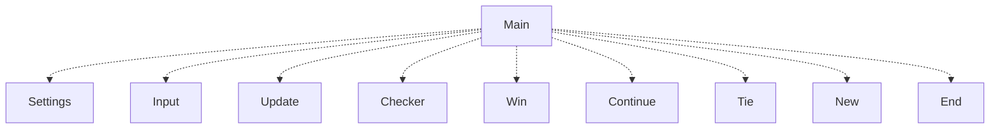
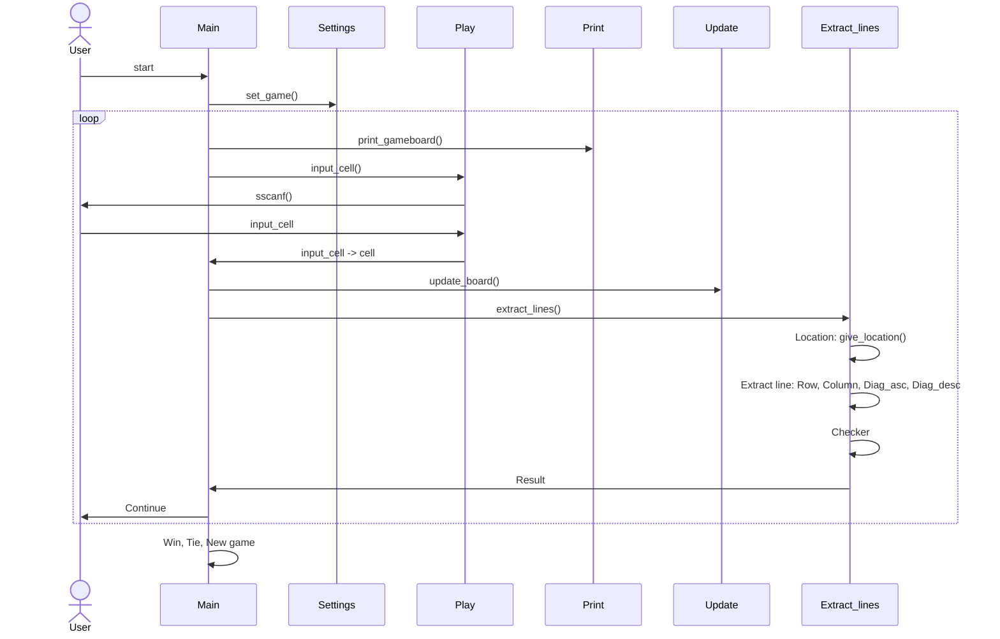

# Architecture
Main loops following switch cases.

## Stucture

```mermaid
flowchart TB
    Main -.-> Settings
    Main -.-> Input
    Main -.-> Update
    Main -.-> Checker
    Main -.-> Win
    Main -.-> Continue
    Main -.-> Tie
    Main -.-> New
    Main -.-> End

```

## Playing the game
Simplified logic.

```mermaid
sequenceDiagram
    actor User
    participant Main
    participant Settings
    participant Play
    participant Print
    participant Update
    participant Extract_lines

    User->> Main: start
    Main->>Settings: set_game()
    loop
        Main->>Print: print_gameboard()
        Main->>Play: input_cell()
        Play->>User: sscanf()
        User->>Play: input_cell
        Play->>Main: input_cell -> cell
        Main->>Update: update_board()
        Main->>Extract_lines: extract_lines()
        Extract_lines->>Extract_lines: Location: give_location()
        Extract_lines->>Extract_lines: Extract line: Row, Column, Diag_asc, Diag_desc
        Extract_lines->>Extract_lines: Checker
        Extract_lines->>Main: Result
        Main->>User: Continue
    end

    Main->>Main: Win, Tie, New game

```
