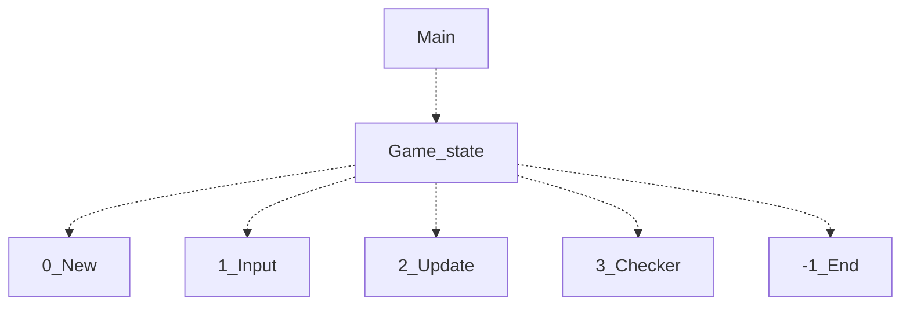
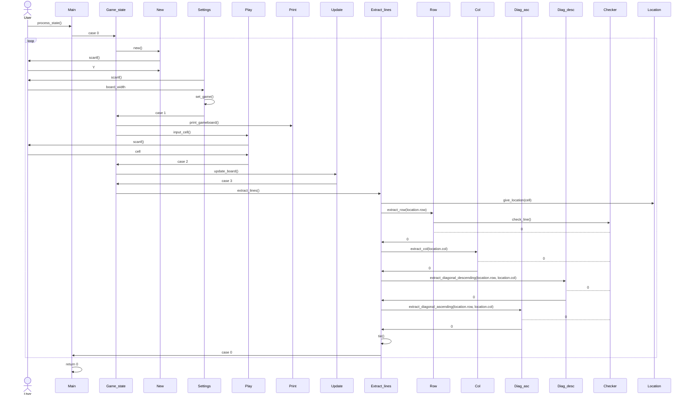

# Architecture
Main loops following switch cases.

## Stucture

```mermaid
flowchart TB
    Main -.-> Game_state
    Game_state -.-> 0_New
    Game_state -.-> 1_Input
    Game_state -.-> 2_Update
    Game_state -.-> 3_Checker
    Game_state -.-> -1_End
```

## Playing the game
Logic in the program in case of tie. Function new() can also return case -1 which ends the loop and main.

```mermaid
sequenceDiagram
    actor User
    participant Main
    participant Game_state
    participant New
    participant Settings
    participant Play
    participant Print
    participant Update
    participant Extract_lines
    participant Row
    participant Col
    participant Diag_asc
    participant Diag_desc
    participant Checker
    participant Location

    User->> Main: process_state()
    Main->>Game_state: case 0
    loop
        Game_state ->> New: new() 
        New ->> User: scanf()
        User ->> New: Y
        Settings ->> User: scanf()
        User ->> Settings: board_width
        Settings ->> Settings: set_game()
        Settings ->> Game_state: case 1
        Game_state ->> Print: print_gameboard()
        Game_state ->> Play: input_cell()
        Play ->> User: scanf()
        User ->> Play: cell
        Play ->> Game_state: case 2
        Game_state ->> Update: update_board()
        Update ->> Game_state: case 3
        Game_state ->> Extract_lines: extract_lines()
        Extract_lines ->> Location: give_location(cell)
        Extract_lines ->> Row: extract_row(location.row)
        Row ->> Checker: check_line()
        Checker --> Row: 0
        Row ->> Extract_lines: 0
        Extract_lines ->> Col: extract_col(location.col)
        Checker --> Col: 0
        Col ->> Extract_lines: 0
        Extract_lines ->> Diag_desc: extract_diagonal_descending(location.row, location.col)
        Checker --> Diag_desc: 0
        Diag_desc ->> Extract_lines: 0
        Extract_lines ->> Diag_asc: extract_diagonal_ascending(location.row, location.col)
        Checker --> Diag_asc: 0
        Diag_asc ->> Extract_lines: 0
        Extract_lines ->> Extract_lines: tie()
        Extract_lines ->> Main: case 0
    end

    Main->>Main: return 0

```
