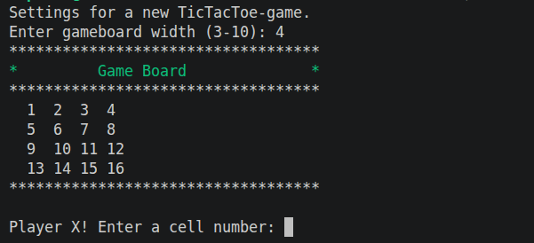
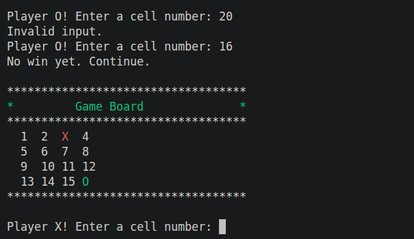
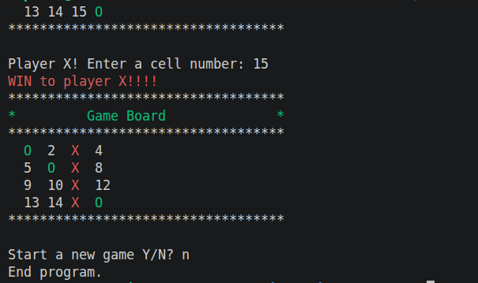

# User manual

Start game on Linux after compiling with command 

    ./gttt 

and on Windows start w_gttt.exe file.

## Playing the game

Game settings on the start define the size of the game board.

Players input cell number which they want to play.

After win or tie the user is asked if they want to play another round or end the game.

